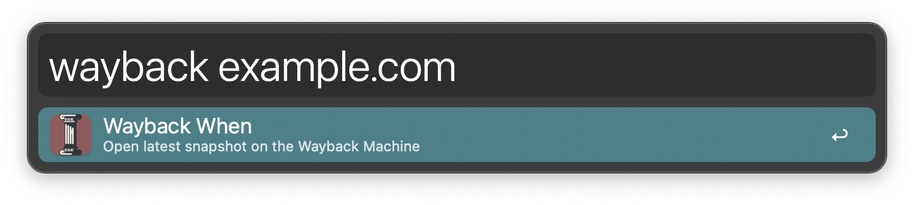

#  Wayback When Alfred Workflow

Open Websites on the Internet Archive’s Wayback Machine

[⤓ Install on the Alfred Gallery](https://alfred.app/workflows/alfredapp/wayback-when)

## Usage

Open the [Internet Archive’s](https://archive.org/) most recent web page snapshot for the frontmost browser tab via the `wayback` keyword.

* <kbd>↩</kbd> Open page. If no snapshot exists, fallback to the action in the [Workflow’s Configuration](https://www.alfredapp.com/help/workflows/user-configuration/).
* <kbd>⌘</kbd><kbd>↩</kbd> Show all snapshots.
* <kbd>⌥</kbd><kbd>↩</kbd> Force fallback.

Alternatively, perform the same actions from a selection or [Clipboard History](https://www.alfredapp.com/help/features/clipboard/) with the [Universal Action](https://www.alfredapp.com/help/features/universal-actions/).

